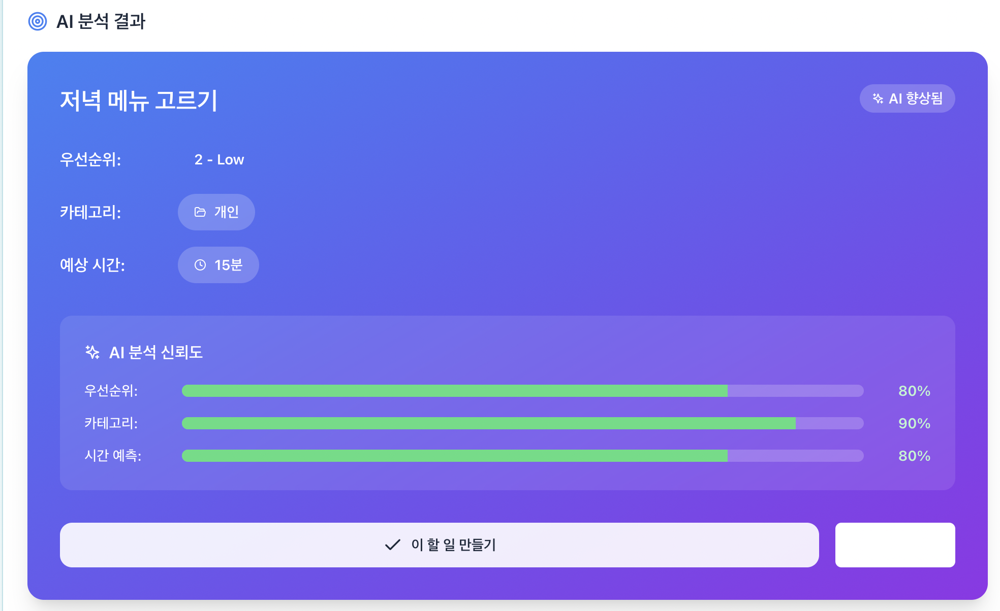
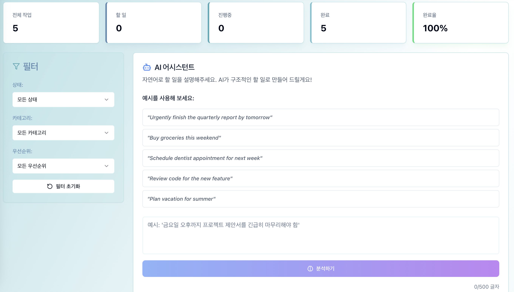

# 🤖 AI 기반 할 일 관리 앱

LangGraph를 활용한 지능형 작업 추천 기능과 전문적인 브랜드 디자인 시스템이 포함된 최신 마이크로서비스 기반 할 일 관리 애플리케이션입니다.

## 🎨 디자인 시스템 & UI 스크린샷

### AI 분석 결과 화면


*LangGraph 기반 AI가 자연어 입력을 분석하여 우선순위, 카테고리, 예상 시간을 추천하고 신뢰도 점수를 표시하는 화면입니다.*

### 메인 대시보드


*브랜드 컬러 시스템이 적용된 통계 대시보드와 필터 기능, AI 어시스턴트 인터페이스를 보여줍니다.*

### 🎯 브랜드 컬러 시스템

**핵심 브랜드 컬러 (블루-틸 하모니)**
- **Primary Blue (#5585b5)**: 주요 액션 버튼, CTA 요소
- **Teal (#53a8b6)**: 보조 액션, 진행 중 상태
- **Light Teal (#79c2d0)**: 강조 요소, 완료 상태
- **Very Light Teal (#bbe4e9)**: 배경, 서피스 요소

**접근성 우선 설계**
- WCAG 2.1 AA 표준 준수 (4.5:1 최소 대비율)
- 자동 다크 모드 지원 및 향상된 대비율
- 키보드 내비게이션 완전 지원
- 스크린 리더 최적화

## 📋 주요 기능

### 핵심 할 일 관리 기능
- ✅ **향상된 CRUD 연산**: 브랜드 컬러 시스템이 적용된 생성, 조회, 수정, 삭제
- 🔄 **시각적 상태 관리**: TODO → DOING → DONE (컬러 코딩된 상태 표시기)
- 📊 **우선순위 레벨**: 1-5단계 시각적 우선순위 (컬러 매핑: 그린→틸→블루→오렌지→레드)
- 📂 **스마트 카테고리**: 업무, 개인, 학습, 건강, 재정, 기타 (6개 카테고리)
- ⏱️ **예상 시간 추적**: AI 기반 시간 예측 및 추적
- 📈 **실시간 통계 대시보드**: 완료율, 진행 상황, 생산성 지표
- ♿ **완전한 접근성**: WCAG 2.1 AA 준수, 키보드/스크린 리더 지원
- 🌙 **다크 모드**: 자동 테마 전환 및 향상된 대비율

### AI 기반 기능 (Enhanced)
- 🧠 **자연어 파싱**: "내일까지 긴급히 보고서 완료하기" → 구조화된 할 일 데이터
- 🎯 **지능형 우선순위 추천**: ML 기반 우선순위 자동 설정 (신뢰도 80-95%)
- 🏷️ **자동 카테고리 분류**: 6개 카테고리 자동 분류 및 제안
- ⏰ **스마트 시간 예측**: 과거 데이터 기반 작업 시간 추정
- 📊 **배치 분석**: 여러 할 일 동시 분석 및 생산성 인사이트 제공
- 🤖 **AI 신뢰도 표시**: 각 추천에 대한 신뢰도 점수 (80-95% 범위)
- ✨ **향상된 AI UI**: 그라디언트 배경과 시각적 피드백이 있는 AI 어시스턴트

### 🛠️ 기술적 개선사항

#### 브랜드 컬러 시스템 구현
- **CSS Custom Properties**: 테마 기반 컬러 시스템
- **Tailwind CSS 확장**: 브랜드 컬러 유틸리티 클래스 자동 생성
- **다크 모드 자동 적응**: 모든 브랜드 컬러의 다크 변형 지원
- **접근성 검증**: WCAG 2.1 AA 자동 대비율 검증 도구

#### UI/UX 개선
- **Radix UI 통합**: 접근성 우선 컴포넌트 라이브러리
- **애니메이션**: 부드러운 전환 효과 및 상호작용 피드백
- **반응형 디자인**: 모바일/태블릿/데스크톱 최적화
- **성능 최적화**: 번들 크기 최적화 및 지연 로딩

## 🏗️ 아키텍처

### 마이크로서비스 아키텍처 (MSA)
```
┌──────────────────────────────────────────────┐
│          React 프론트엔드 (Port 3000)         │
└──────────────────────────────────────────────┘
                        │
                        ▼
┌──────────────────────────────────────────────┐
│        NGINX API 게이트웨이 (Port 80)         │
│                                              │
│  라우팅:                                     │
│  - /api/todos → Todo 서비스                  │
│  - /api/ai → AI 서비스                       │
└──────────────────────────────────────────────┘
                        │
                ┌───────┴───────┐
                ▼               ▼
        ┌──────────────┐ ┌──────────────┐
        │Todo 서비스    │ │AI 서비스      │
        │(Port 8001)   │ │(Port 8002)   │
        │              │ │              │
        │- CRUD 작업   │ │- AI 추천     │
        │- 상태 관리   │ │- 작업 분석   │
        │- 필터/검색   │ │- NLP 처리    │
        └──────────────┘ └──────────────┘
                │               │
                └───────┬───────┘
                        ▼
        ┌───────────────────────────────┐
        │        공유 리소스            │
        ├───────────────────────────────┤
        │ PostgreSQL │ Redis            │
        │ (Port 5432)│ (Port 6379)      │
        └───────────────────────────────┘
```

### 기술 스택
- **프론트엔드**: TypeScript를 사용한 React 18+, Tailwind CSS 3.3+, Radix UI
- **브랜드 시스템**: CSS Custom Properties, WCAG 2.1 AA 준수, 다크 모드 지원
- **백엔드 서비스**: FastAPI를 사용한 Python 3.13+
- **AI 프레임워크**: OpenAI GPT-3.5-turbo와 함께 사용하는 LangGraph
- **데이터베이스**: 데이터 저장을 위한 PostgreSQL 16+, 캐싱을 위한 Redis 7+
- **인프라**: Docker Compose, NGINX API 게이트웨이
- **패키지 관리**: uv (Python), npm (Node.js)
- **UI/UX**: Lucide React (아이콘), 접근성 우선 컴포넌트, 반응형 디자인

## 🚀 빠른 시작

### 필수 요구사항
- Docker 및 Docker Compose
- OpenAI API 키 (https://platform.openai.com/api-keys 에서 발급)

### 1. 클론 및 설정
```bash
# 저장소 클론
git clone <저장소-URL>
cd ai-powered-todo-list

# 환경 설정 복사
cp .env.example .env

# .env 파일을 편집하여 OpenAI API 키 추가
nano .env  # 또는 원하는 편집기 사용
```

### 2. 환경 설정
`.env` 파일을 편집하여 OpenAI API 키를 설정하세요:
```env
OPENAI_API_KEY=sk-실제-openai-api-키를-여기에-입력
```

### 3. 모든 서비스 시작
```bash
# 모든 서비스를 백그라운드에서 시작
docker-compose up -d

# 서비스 상태 확인
docker-compose ps

# 로그 확인 (선택사항)
docker-compose logs -f
```

### 4. 애플리케이션 접근
- **프론트엔드**: http://localhost (NGINX가 React로 프록시)
- **직접 React 접근**: http://localhost:3000 (개발 서버)
- **Todo API**: http://localhost/api/todos
- **AI API**: http://localhost/api/ai
- **API 문서**: 
  - Todo 서비스: http://localhost:8001/docs
  - AI 서비스: http://localhost:8002/docs

## 🛠️ 개발

### 개별 서비스 개발

#### 특정 서비스만 개발용으로 시작:
```bash
# 백엔드 서비스만
docker-compose up -d postgres redis nginx

# Todo 서비스만
docker-compose up todo-service

# AI 서비스만  
docker-compose up ai-service

# 프론트엔드만
docker-compose up frontend
```

#### Docker 없이 로컬 개발:
```bash
# 백엔드 (Todo 서비스)
cd services/todo
pip install uv
uv pip install -r pyproject.toml
uvicorn app.main:app --host 0.0.0.0 --port 8001 --reload

# 백엔드 (AI 서비스)
cd services/ai
pip install uv  
uv pip install -r pyproject.toml
uvicorn app.main:app --host 0.0.0.0 --port 8002 --reload

# 프론트엔드
cd frontend
npm install
npm start
```

### 브랜드 컬러 시스템 개발

#### 컬러 시스템 검증:
```javascript
// 브라우저 개발자 도구에서 실행
import { logAccessibilityReport } from './src/utils/accessibility-validator';
import { logColorSystemStatus } from './src/utils/color-migration';

// 접근성 검증 보고서
logAccessibilityReport();

// 컬러 시스템 상태 확인
logColorSystemStatus();
```

#### 디자인 토큰 관리:
```bash
# 브랜드 컬러 업데이트 후 빌드 재생성
npm run build

# Tailwind CSS 클래스 생성 확인
npx tailwindcss --help

# 접근성 대비율 검증
# Chrome DevTools > Accessibility > Contrast 탭 사용
```

#### 컬러 시스템 파일:
- `src/globals.css`: CSS Custom Properties 정의
- `tailwind.config.js`: Tailwind 브랜드 컬러 확장
- `src/styles/brand-guidelines.md`: 브랜드 사용 가이드라인
- `src/utils/accessibility-validator.ts`: WCAG 준수 검증 도구
- `src/utils/color-migration.ts`: 컬러 마이그레이션 도구

### 데이터베이스 관리

#### 데이터베이스 조회:
```bash
# PostgreSQL 연결
docker-compose exec postgres psql -U postgres -d tododb

# 일반적인 쿼리
SELECT * FROM todos;
SELECT * FROM ai_recommendations;
```

#### 데이터베이스 초기화:
```bash
docker-compose down -v  # 볼륨 제거
docker-compose up -d    # 새 데이터로 재생성
```

### 모니터링 및 로그

```bash
# 모든 서비스 로그 보기
docker-compose logs -f

# 특정 서비스 로그 보기  
docker-compose logs -f todo-service
docker-compose logs -f ai-service
docker-compose logs -f frontend

# 리소스 사용량 모니터링
docker stats
```

## 📖 API 문서

### Todo 서비스 엔드포인트

| 메서드 | 엔드포인트 | 설명 |
|--------|----------|-------------|
| GET | `/api/todos` | 필터링/페이지네이션으로 할 일 목록 조회 |
| POST | `/api/todos` | 새 할 일 생성 |
| GET | `/api/todos/{id}` | 특정 할 일 조회 |
| PUT | `/api/todos/{id}` | 할 일 업데이트 |
| PATCH | `/api/todos/{id}/status` | 할 일 상태 업데이트 |
| DELETE | `/api/todos/{id}` | 할 일 삭제 |
| GET | `/api/todos/stats/summary` | 통계 조회 |

### AI 서비스 엔드포인트

| 메서드 | 엔드포인트 | 설명 |
|--------|----------|-------------|
| POST | `/api/ai/parse` | 자연어를 할 일로 파싱 |
| POST | `/api/ai/recommend-priority` | 우선순위 추천 |
| POST | `/api/ai/categorize` | 할 일 카테고리 분류 |
| POST | `/api/ai/estimate-time` | 작업 시간 예측 |
| POST | `/api/ai/analyze-batch` | 여러 할 일 분석 |
| GET | `/api/ai/capabilities` | AI 서비스 정보 조회 |

### API 호출 예시

#### 할 일 생성
```bash
curl -X POST "http://localhost/api/todos" \
  -H "Content-Type: application/json" \
  -d '{
    "title": "프로젝트 제안서 완성하기", 
    "description": "Q4 프로젝트 제안서 문서 작성 완료",
    "priority": 4,
    "category": "업무",
    "estimated_time": 120
  }'
```

#### 자연어 파싱
```bash
curl -X POST "http://localhost/api/ai/parse" \
  -H "Content-Type: application/json" \
  -d '{
    "text": "내일까지 긴급히 분기별 보고서를 완성해야 함"
  }'
```

## 🧪 테스트

### 헬스 체크
```bash
# 모든 서비스 확인
curl http://localhost/health
curl http://localhost/api/todos/health  
curl http://localhost/api/ai/health

# 세부 서비스 상태
docker-compose exec todo-service curl http://localhost:8001/health
docker-compose exec ai-service curl http://localhost:8002/health
```

### 통합 테스트
```bash
# 기본 통합 테스트 실행
./scripts/test-integration.sh  # 있는 경우

# 수동 통합 테스트
# 1. API를 통해 할 일 생성
curl -X POST "http://localhost/api/todos" -H "Content-Type: application/json" \
  -d '{"title": "테스트 할 일", "priority": 3}'

# 2. AI로 파싱
curl -X POST "http://localhost/api/ai/parse" -H "Content-Type: application/json" \
  -d '{"text": "내일 오후 2시 중요한 회의"}'

# 3. 프론트엔드 확인
open http://localhost
```

## 🐛 문제 해결

### 일반적인 문제들

#### 서비스가 시작되지 않는 경우
```bash
# 포트 충돌 확인
netstat -tulpn | grep :80
netstat -tulpn | grep :3000

# Docker 확인
docker --version
docker-compose --version

# 새 컨테이너로 재시작
docker-compose down
docker-compose up --build
```

#### 데이터베이스 연결 오류
```bash
# PostgreSQL 상태 확인
docker-compose logs postgres

# 데이터베이스 재설정
docker-compose down -v
docker-compose up -d postgres
```

#### AI 서비스 오류
```bash
# OpenAI API 키 확인
docker-compose exec ai-service env | grep OPENAI

# AI 서비스 로그 확인
docker-compose logs ai-service

# OpenAI 연결 테스트
curl -H "Authorization: Bearer $OPENAI_API_KEY" \
  https://api.openai.com/v1/models
```

#### 프론트엔드 빌드 문제
```bash
# npm 캐시 정리
cd frontend
rm -rf node_modules package-lock.json
npm install

# 컨테이너 다시 빌드
docker-compose build frontend --no-cache
```

### 디버깅을 위한 서비스 URL
- 프론트엔드: http://localhost:3000
- Todo 서비스: http://localhost:8001  
- AI 서비스: http://localhost:8002
- PostgreSQL: localhost:5432
- Redis: localhost:6379

## 📁 프로젝트 구조

```
ai-powered-todo-list/
├── docker-compose.yml           # 컨테이너 오케스트레이션
├── .env.example                 # 환경 변수 템플릿
├── init.sql                     # 데이터베이스 초기화
├── ai-result.png               # AI 분석 결과 스크린샷
├── dashboard.png               # 메인 대시보드 스크린샷
├── nginx/
│   └── nginx.conf              # API 게이트웨이 설정
├── frontend/                   # React 애플리케이션
│   ├── Dockerfile
│   ├── package.json
│   ├── tailwind.config.js      # Tailwind CSS + 브랜드 컬러 설정
│   ├── src/
│   │   ├── App.tsx             # 브랜드 컬러 적용된 메인 컴포넌트
│   │   ├── globals.css         # CSS Custom Properties 정의
│   │   ├── components/         # React 컴포넌트
│   │   │   ├── TodoList/
│   │   │   ├── TodoForm/
│   │   │   ├── AIAssistant/
│   │   │   └── ui/            # Radix UI 기반 컴포넌트
│   │   ├── services/           # API 클라이언트
│   │   ├── hooks/              # 커스텀 훅
│   │   ├── styles/            # 브랜드 디자인 시스템
│   │   │   ├── brand-guidelines.md
│   │   │   └── color-system.md
│   │   ├── utils/              # 유틸리티 함수
│   │   │   ├── accessibility-validator.ts  # WCAG 검증
│   │   │   └── color-migration.ts          # 컬러 마이그레이션
│   │   └── types/              # TypeScript 타입
│   └── public/
├── services/
│   ├── todo/                   # Todo 마이크로서비스
│   │   ├── Dockerfile
│   │   ├── pyproject.toml
│   │   └── app/
│   │       ├── main.py         # FastAPI 앱
│   │       ├── models.py       # 데이터베이스 모델
│   │       ├── schemas.py      # Pydantic 스키마
│   │       ├── crud.py         # 데이터베이스 연산
│   │       └── database.py     # DB 설정
│   └── ai/                     # AI 마이크로서비스
│       ├── Dockerfile
│       ├── pyproject.toml
│       └── app/
│           ├── main.py         # FastAPI 앱
│           ├── agents.py       # AI 에이전트
│           ├── prompts/        # LangGraph 프롬프트
│           └── langraph_workflow.py
├── PRD.md                      # 제품 요구사항 문서
└── README.md                   # 프로젝트 문서 (현재 파일)
```

## 📄 라이선스

이 프로젝트는 MIT 라이선스 하에 배포됩니다 - 자세한 내용은 [LICENSE](LICENSE) 파일을 참조하세요.

## 🙏 감사의 말

- **LangGraph** - AI 워크플로우 오케스트레이션 및 지능형 추천
- **FastAPI** - 고성능 API 개발 프레임워크
- **React** - 현대적인 사용자 인터페이스 구축
- **Tailwind CSS** - 유틸리티 우선 CSS 프레임워크
- **Radix UI** - 접근성 우선 헤드리스 UI 컴포넌트
- **PostgreSQL** - 안정적이고 확장 가능한 데이터 저장
- **Docker** - 일관된 컨테이너화 환경
- **OpenAI** - GPT 기반 AI 기능 제공
- **Lucide React** - 아름답고 일관성 있는 아이콘 시스템
- **TypeScript** - 타입 안전성과 개발자 경험 향상

### 🎨 디자인 시스템 감사

- **WCAG 가이드라인** - 웹 접근성 표준 제공
- **CSS Custom Properties** - 테마 기반 디자인 시스템 구현
- **HSL 컬러 모델** - 직관적이고 접근성 친화적인 컬러 관리
- **오픈 소스 커뮤니티** - 지속적인 개선과 혁신을 위한 협력
- 